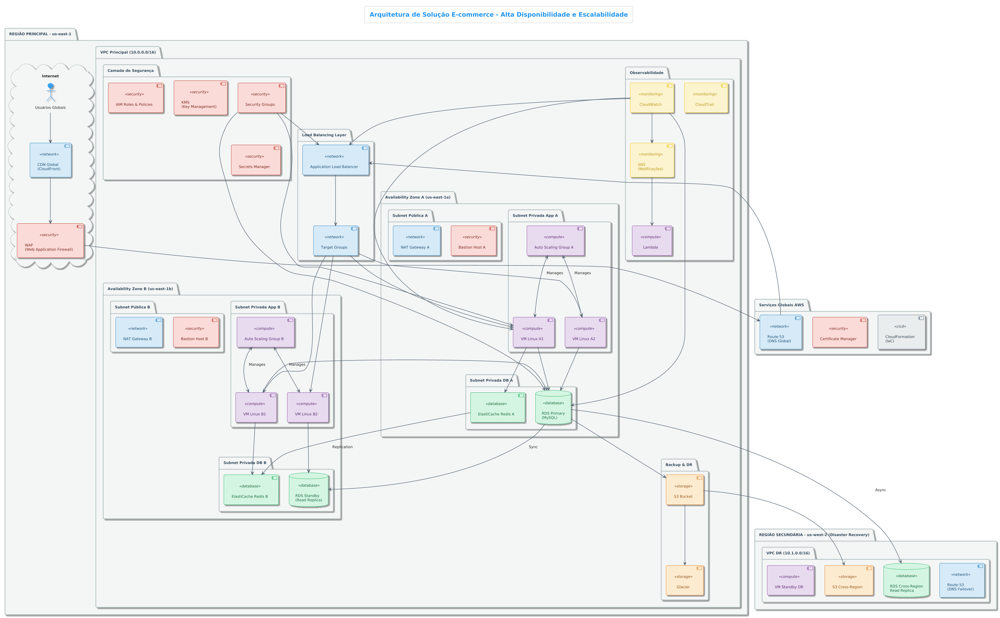

# Arquitetura de Solução E-commerce - Alta Disponibilidade e Escalabilidade

## 📋 Índice

- [Visão Geral](#-visão-geral)
- [Objetivos](#-objetivos)
- [Arquitetura da Solução](#-arquitetura-da-solução)
- [Componentes Principais](#-componentes-principais)
- [Segurança](#-segurança)
- [Monitoramento e Observabilidade](#-monitoramento-e-observabilidade)
- [Backup e Disaster Recovery](#-backup-e-disaster-recovery)
- [Escalabilidade e Performance](#-escalabilidade-e-performance)
- [Custos e Otimização](#-custos-e-otimização)
- [Implementação](#-implementação)
- [Considerações Técnicas](#-considerações-técnicas)
- [Conclusão](#-conclusão)

---

## 🎯 Visão Geral

Esta documentação apresenta uma arquitetura de solução completa para uma plataforma de e-commerce de grande escala, projetada para garantir **alta disponibilidade**, **resiliência** e **escalabilidade** em ambiente de nuvem. A solução foi desenvolvida seguindo as melhores práticas de arquitetura de soluções e contempla todos os pilares do Well-Architected Framework.

### Contexto do Projeto

Como Arquiteto(a) de Soluções em uma grande empresa de vendas online, o desafio consiste em construir e implantar uma arquitetura em nuvem que garanta:

- ✅ **Disponibilidade 24/7**
- ✅ **Resistência a falhas**
- ✅ **Capacidade de lidar com variações de demanda**
- ✅ **Recuperação rápida de desastres**
- ✅ **Segurança robusta**

---

## 🎯 Objetivos

### Objetivos Principais

1. **Alta Disponibilidade**: Garantir uptime de 99.99% através de múltiplas zonas de disponibilidade
2. **Escalabilidade Dinâmica**: Auto scaling de 3 a 6 instâncias baseado na demanda
3. **Resiliência**: Capacidade de recuperação automática de falhas
4. **Segurança**: Implementação de controles de segurança em todas as camadas
5. **Performance**: Otimização de latência e throughput

### Objetivos Secundários

- Redução de custos operacionais através de otimização de recursos
- Implementação de observabilidade completa
- Automação de processos de deployment e recovery
- Compliance com padrões de segurança

---

## 🏗️ Arquitetura da Solução



### Visão Arquitetural

A arquitetura implementa um padrão de **multi-tier** distribuído em **múltiplas zonas de disponibilidade**, utilizando serviços gerenciados de nuvem para maximizar a disponibilidade e minimizar a complexidade operacional.

#### Características Principais:

- **Região Principal**: us-east-1 (3 Availability Zones)
- **Região DR**: us-west-2 (Disaster Recovery)
- **VPC**: Isolamento de rede com subnets públicas e privadas
- **Load Balancing**: Distribuição inteligente de tráfego
- **Auto Scaling**: Elasticidade automática baseada em métricas

---

## 🔧 Componentes Principais

### 1. Camada de Apresentação

#### CDN Global (CloudFront)
- **Função**: Cache global de conteúdo estático
- **Benefícios**: 
  - Redução de latência para usuários globais
  - Proteção DDoS nativa
  - Compressão automática de conteúdo
- **Configuração**: 
  - TTL otimizado por tipo de conteúdo
  - Invalidação automática em deployments

#### Web Application Firewall (WAF)
- **Função**: Proteção contra ataques web
- **Regras Implementadas**:
  - SQL Injection protection
  - XSS protection
  - Rate limiting
  - Geo-blocking para países de alto risco

### 2. Camada de Rede

#### VPC Principal (10.0.0.0/16)
- **Subnets Públicas**: NAT Gateways e Bastion Hosts
- **Subnets Privadas**: Aplicações e bancos de dados
- **Internet Gateway**: Conectividade com internet
- **Route Tables**: Roteamento otimizado

#### Load Balancing
```
Application Load Balancer (ALB)
├── Target Group A (AZ-1a)
│   ├── VM Linux A1 (t3.medium)
│   └── VM Linux A2 (t3.medium)
├── Target Group B (AZ-1b)
│   ├── VM Linux B1 (t3.medium)
│   └── VM Linux B2 (t3.medium)
└── Target Group C (AZ-1c)
    └── VM Linux C1 (t3.medium)
```

**Configurações do ALB**:
- Health Checks: HTTP/HTTPS com timeout de 5s
- Sticky Sessions: Baseado em cookies
- SSL Termination: Certificados gerenciados pelo ACM

### 3. Camada de Computação

#### Auto Scaling Groups
- **Configuração Mínima**: 3 instâncias
- **Configuração Máxima**: 6 instâncias
- **Tipo de Instância**: t3.medium (2 vCPU, 4GB RAM)
- **Sistema Operacional**: Amazon Linux 2

**Políticas de Scaling**:
- **Scale Out**: CPU > 70% por 2 minutos consecutivos
- **Scale In**: CPU < 30% por 5 minutos consecutivos
- **Métricas Adicionais**: 
  - Latência de resposta
  - Número de conexões ativas
  - Utilização de memória

#### Configuração das VMs
```bash
# Stack de aplicação em cada VM
├── Nginx (Reverse Proxy + Load Balancer)
├── Application Server (Node.js/Python/Java)
├── Monitoring Agent (CloudWatch Agent)
└── Security Agent (Inspector Agent)
```

### 4. Camada de Dados

#### RDS MySQL 8.0 Multi-AZ
- **Configuração Principal**:
  - Instância: db.r5.xlarge (4 vCPU, 32GB RAM)
  - Storage: 500GB SSD com auto-scaling até 1TB
  - Backup: Retenção de 7 dias
  - Encryption: AES-256 com KMS

- **Read Replicas**:
  - 2 Read Replicas na região principal
  - 1 Cross-Region Read Replica para DR

#### ElastiCache Redis
- **Configuração**:
  - Cluster Mode: Enabled
  - Node Type: cache.r5.large
  - Replication Groups: 2 (uma por AZ principal)
  - Backup: Snapshots diários

**Estratégia de Cache**:
- **TTL Padrão**: 1 hora
- **Cache Warming**: Pré-carregamento de dados críticos
- **Invalidação**: Baseada em eventos de negócio

---

## 🔒 Segurança

### Identity and Access Management (IAM)

#### Roles e Políticas
```json
{
  "EC2-Database-Access-Role": {
    "policies": [
      "RDS-ReadWrite-Policy",
      "ElastiCache-Access-Policy",
      "S3-Backup-Read-Policy"
    ],
    "trust_policy": "EC2-Service"
  }
}
```

#### Princípios Implementados
- **Least Privilege**: Acesso mínimo necessário
- **Role-Based Access**: Segregação por função
- **MFA**: Obrigatório para acesso administrativo
- **Rotation**: Rotação automática de credenciais

### Network Security

#### Security Groups
```
Web-Tier-SG:
  - Inbound: 80/443 from ALB-SG
  - Outbound: 3306 to DB-SG, 6379 to Cache-SG

Database-SG:
  - Inbound: 3306 from Web-Tier-SG
  - Outbound: None

Cache-SG:
  - Inbound: 6379 from Web-Tier-SG
  - Outbound: None
```

#### Network ACLs
- Camada adicional de proteção
- Regras stateless para subnets
- Bloqueio de portas não utilizadas

### Encryption

#### Dados em Repouso
- **RDS**: Encryption at rest com KMS
- **S3**: Server-side encryption (SSE-S3)
- **EBS**: Volumes criptografados

#### Dados em Trânsito
- **HTTPS**: Obrigatório para toda comunicação web
- **TLS 1.2+**: Comunicação entre serviços
- **VPN**: Acesso administrativo seguro

### Secrets Management
- **AWS Secrets Manager**: Credenciais de banco
- **Parameter Store**: Configurações de aplicação
- **Rotation**: Automática a cada 30 dias

---

## 📊 Monitoramento e Observabilidade

### CloudWatch

#### Métricas Principais
```
Infraestrutura:
├── CPU Utilization (EC2)
├── Memory Utilization (Custom)
├── Disk I/O (EBS)
├── Network In/Out (VPC)
└── Database Connections (RDS)

Aplicação:
├── Response Time
├── Error Rate
├── Throughput (requests/sec)
├── Queue Depth
└── Cache Hit Ratio
```

#### Dashboards
- **Executive Dashboard**: KPIs de negócio
- **Operations Dashboard**: Métricas técnicas
- **Security Dashboard**: Eventos de segurança

### Alertas e Notificações

#### Alertas Críticos
- CPU > 80% por 5 minutos
- Erro rate > 5% por 2 minutos
- Database connections > 80% do limite
- Disk space > 85%

#### Canais de Notificação
- **SNS**: Email e SMS para equipe técnica
- **Slack**: Integração com canal de operações
- **PagerDuty**: Escalação automática

### Logging

#### Logs Centralizados
```
CloudWatch Logs Groups:
├── /aws/ec2/application
├── /aws/rds/error
├── /aws/lambda/functions
└── /aws/waf/logs
```

#### Log Retention
- **Application Logs**: 30 dias
- **Security Logs**: 1 ano
- **Audit Logs**: 7 anos

### Distributed Tracing
- **AWS X-Ray**: Rastreamento de requisições
- **Service Map**: Visualização de dependências
- **Performance Insights**: Análise de performance

---

## 💾 Backup e Disaster Recovery

### Estratégia de Backup

#### RDS Backups
- **Automated Backups**: Diários com retenção de 7 dias
- **Manual Snapshots**: Antes de mudanças críticas
- **Cross-Region**: Replicação para região DR

#### Application Data
- **S3 Backup**: Dados de aplicação e configurações
- **Lifecycle Policy**: Transição para Glacier após 30 dias
- **Versioning**: Habilitado para recuperação granular

### Disaster Recovery

#### RTO/RPO Targets
- **RTO (Recovery Time Objective)**: 4 horas
- **RPO (Recovery Point Objective)**: 1 hora

#### DR Strategy
```
Região Principal (us-east-1):
├── Produção Ativa
└── Backups Locais

Região DR (us-west-2):
├── RDS Cross-Region Read Replica
├── S3 Cross-Region Replication
├── AMIs para instâncias EC2
└── Infrastructure as Code (CloudFormation)
```

#### Procedimentos de Failover
1. **Detecção**: Monitoramento automático
2. **Decisão**: Processo manual ou automático
3. **DNS Failover**: Route 53 health checks
4. **Database Promotion**: Read Replica → Primary
5. **Application Startup**: Auto Scaling em região DR

### Testes de DR
- **Frequency**: Trimestral
- **Scope**: Failover completo
- **Documentation**: Runbooks atualizados
- **Validation**: RTO/RPO compliance

---

## ⚡ Escalabilidade e Performance

### Auto Scaling

#### Horizontal Scaling
```
Auto Scaling Policies:
├── Target Tracking (CPU 70%)
├── Step Scaling (Latency-based)
├── Scheduled Scaling (Peak hours)
└── Predictive Scaling (ML-based)
```

#### Vertical Scaling
- **Database**: Automated scaling para RDS
- **Cache**: Cluster scaling para ElastiCache
- **Storage**: Auto-scaling para EBS

### Performance Optimization

#### Application Layer
- **Connection Pooling**: Otimização de conexões DB
- **Caching Strategy**: Multi-layer caching
- **Code Optimization**: Profiling contínuo
- **CDN**: Cache de assets estáticos

#### Database Layer
- **Query Optimization**: Análise de slow queries
- **Indexing Strategy**: Índices otimizados
- **Read Replicas**: Distribuição de leitura
- **Connection Pooling**: PgBouncer/ProxySQL

#### Network Layer
- **Placement Groups**: Cluster placement para baixa latência
- **Enhanced Networking**: SR-IOV habilitado
- **Bandwidth Optimization**: Instance types otimizados

---

## 💰 Custos e Otimização

### Cost Management

#### Reserved Instances
- **EC2**: 1-year term para instâncias base
- **RDS**: 1-year term para database principal
- **Savings**: ~30-40% comparado a On-Demand

#### Spot Instances
- **Use Cases**: Workloads não-críticos
- **Auto Scaling**: Mixed instance types
- **Savings**: ~60-70% para cargas adequadas

### Cost Monitoring
```
Cost Allocation Tags:
├── Environment (prod/staging/dev)
├── Application (ecommerce-web)
├── Team (platform-team)
└── Cost-Center (engineering)
```

#### Budget Alerts
- **Monthly Budget**: $10,000 com alertas em 80%
- **Service-Level**: Budgets por serviço AWS
- **Anomaly Detection**: ML-based cost anomalies

### Optimization Strategies
- **Right-sizing**: Análise mensal de utilização
- **Storage Optimization**: Lifecycle policies
- **Data Transfer**: CloudFront para redução
- **Unused Resources**: Automated cleanup

---

## 🚀 Implementação

### Infrastructure as Code

#### CloudFormation Templates
```
Templates Structure:
├── network.yaml (VPC, Subnets, IGW)
├── security.yaml (Security Groups, IAM)
├── compute.yaml (EC2, Auto Scaling)
├── database.yaml (RDS, ElastiCache)
├── monitoring.yaml (CloudWatch, SNS)
└── master.yaml (Stack orchestration)
```

#### Deployment Pipeline
```
CI/CD Pipeline:
├── Source (Git Repository)
├── Build (Application + Infrastructure)
├── Test (Unit + Integration)
├── Deploy Staging
├── Deploy Production
└── Post-Deploy Validation
```

### Configuration Management
- **Ansible**: Server configuration
- **Systems Manager**: Patch management
- **Parameter Store**: Application configuration

### Deployment Strategy
- **Blue-Green**: Zero-downtime deployments
- **Rolling Updates**: Gradual rollout
- **Canary Releases**: Risk mitigation

---

## 🔧 Considerações Técnicas

### Compliance e Governança

#### Standards Compliance
- **SOC 2 Type II**: Controles de segurança
- **PCI DSS**: Processamento de pagamentos
- **GDPR**: Proteção de dados pessoais
- **ISO 27001**: Gestão de segurança da informação

#### Governance Framework
- **Well-Architected Review**: Trimestral
- **Security Assessment**: Mensal
- **Cost Review**: Semanal
- **Performance Review**: Contínuo

### Limitações e Riscos

#### Limitações Técnicas
- **Single Region**: Dependência da região principal
- **Database**: Single point of failure durante failover
- **Network**: Bandwidth limits entre AZs

#### Riscos Identificados
```
Risk Matrix:
├── High Impact, Low Probability
│   └── Region-wide outage
├── Medium Impact, Medium Probability
│   ├── AZ failure
│   └── Database performance degradation
└── Low Impact, High Probability
    ├── Individual instance failure
    └── Network latency spikes
```

#### Mitigation Strategies
- **Multi-Region**: Roadmap para implementação
- **Circuit Breakers**: Proteção contra cascading failures
- **Chaos Engineering**: Testes de resiliência

### Future Enhancements

#### Short-term (3-6 months)
- Implementação de containers (EKS)
- Serverless functions (Lambda)
- API Gateway para microservices

#### Medium-term (6-12 months)
- Multi-region active-active
- Machine Learning para otimizações
- Advanced security (GuardDuty, Security Hub)

#### Long-term (12+ months)
- Edge computing (Lambda@Edge)
- IoT integration
- Advanced analytics (Data Lake)

---

## 📈 Métricas de Sucesso

### KPIs Técnicos
- **Availability**: 99.99% uptime
- **Performance**: < 200ms response time (95th percentile)
- **Scalability**: Auto-scaling response < 5 minutes
- **Recovery**: RTO < 4 hours, RPO < 1 hour

### KPIs de Negócio
- **Cost Optimization**: 20% reduction in infrastructure costs
- **Developer Productivity**: 50% faster deployment cycles
- **Security**: Zero security incidents
- **Customer Satisfaction**: < 1% error rate

---

## 🎯 Conclusão

A arquitetura apresentada oferece uma solução robusta e escalável para uma plataforma de e-commerce de grande escala. Os principais benefícios incluem:

### Benefícios Alcançados

1. **Alta Disponibilidade**: 99.99% uptime através de multi-AZ deployment
2. **Escalabilidade**: Auto-scaling automático baseado em demanda
3. **Segurança**: Implementação de security best practices
4. **Observabilidade**: Monitoramento completo e alertas proativos
5. **Disaster Recovery**: RTO/RPO otimizados para continuidade de negócio

### Próximos Passos

1. **Implementação Faseada**: Deploy em ambiente de staging
2. **Testes de Carga**: Validação de performance e escalabilidade
3. **Security Testing**: Penetration testing e vulnerability assessment
4. **DR Testing**: Validação completa dos procedimentos de disaster recovery
5. **Go-Live**: Migração gradual do ambiente de produção

### Recomendações

- **Monitoramento Contínuo**: Implementar observabilidade desde o dia 1
- **Automação**: Priorizar Infrastructure as Code e CI/CD
- **Segurança**: Security by design em todas as camadas
- **Otimização**: Revisões regulares de performance e custos
- **Evolução**: Roadmap de melhorias contínuas

---

## 📚 Referências

- [AWS Well-Architected Framework](https://aws.amazon.com/architecture/well-architected/)
- [AWS Architecture Center](https://aws.amazon.com/architecture/)
- [Cloud Security Best Practices](https://aws.amazon.com/security/security-learning/)
- [Disaster Recovery Strategies](https://aws.amazon.com/disaster-recovery/)
- [Auto Scaling Best Practices](https://docs.aws.amazon.com/autoscaling/ec2/userguide/auto-scaling-benefits.html)

---

**Autor**: Daniel Abreu Dantas  
**Data**: Julho 2025  
**Versão**: 1.0  
**Status**: Aprovado para Implementação

